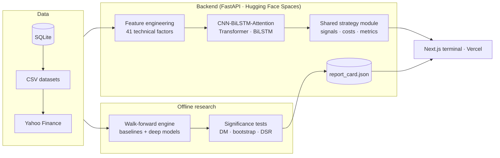

# Quantum Yield

**A quantitative research terminal that tests its own deep-learning forecasts and shows how they performed out-of-sample, even when the answer is "no better than a coin flip".**

[](https://github.com/amoghsamadhiya779-afk/Quantitative-stock-analyzer/actions/workflows/ci.yml)


Quantum Yield covers eight equity markets (US, India, Japan, UK, Germany, Turkey, Brazil, Indonesia). A FastAPI backend serves three deep-learning architectures, a backtester, risk analytics and news sentiment. A Next.js terminal presents them, and a walk-forward **Model Report Card** checks every model against simple baselines with proper significance tests.

**Live API:** [1amogh212-quant-modeling.hf.space/docs](https://1amogh212-quant-modeling.hf.space/docs)

---

## Why this project is different

Most stock-prediction projects report an impressive backtest and stop there. This one treats the model as a hypothesis and tries to break it:

- **Every model is scored against baselines.** A random walk, the historical mean, 20-day momentum, ridge regression and gradient boosting run on the same out-of-sample days as the neural networks.
- **Results carry significance tests.** A binomial test on directional accuracy, a Diebold-Mariano test against the random walk, block-bootstrap confidence intervals on Sharpe, and the **Deflated Sharpe Ratio** to correct for trying many models on the same data.
- **Leakage is tested, not assumed.** The test suite rewrites future prices and asserts that no feature or forecast before that point changes. It also checks that the evaluation finds a planted edge in synthetic autocorrelated returns and finds none in a random walk.
- **Every price and statistic in the UI is real.** When a data source is down, the terminal says "unavailable" rather than filling the gap.

## What the research found

Measured with the walk-forward evaluation on public daily data: the S&P 500 index from 2009 to 2018 (2,515 out-of-sample days) and Google from 2008 to 2013 (1,074 days).

**1. The neural networks have no reliable directional edge on daily returns.** Directional accuracy was 48–53% for every model. The retrained CNN-BiLSTM-Attention scored 50.2% and 50.6% (p = 0.44 and 0.36 against a coin flip). This matches the academic consensus on daily equity returns and is reported, not hidden.

**2. The original backtest lost money because of its short side, not its forecasts.** Splitting the MA20/MA50 trend filter into its two sides:

| Strategy Sharpe (net of 5 bps costs) | Long side only | Short side only | Long + short (original) |
|---|---|---|---|
| S&P 500, 2009–2018 | **+0.44** | −0.52 | −0.05 |
| Google, 2008–2013 | **+0.53** | −1.00 | −0.26 |

Equities drift upward, so shorting on a bearish signal fights that drift. Switching the served strategy to **long or flat** raised every model's out-of-sample Sharpe from between −0.26 and 0.01 to between +0.25 and +0.70, and cut the worst drawdown from 24–38% to 8–25%. It still trails buy-and-hold on total return; the benefit is a much shallower drawdown.

**3. Two training bugs were found and fixed.**
- **Off-by-one target.** Training labelled the 60-day window ending on day *t* with the return from *t+1* to *t+2*, while the API served the model as a *t* → *t+1* forecast.
- **Test-set leakage.** Early stopping and checkpointing watched the test split, so the reported test loss was not really out-of-sample.

The full per-market results are generated by `build_report_card.py` and shown on the terminal's **Model Report Card** page.

---

## Architecture



- **One strategy implementation.** The API's backtest, the offline validation and the report card all call `src/strategy.py`, so what is validated is exactly what is served.
- **One market registry.** `src/config.py` defines the eight markets for every component.
- **Data fallback.** Each request tries SQLite, then the CSV datasets, then a live Yahoo Finance download, and fails with an explicit error rather than synthetic data.

## The terminal

| View | What it shows |
|---|---|
| **Overview** | One year of daily closes with 20/50-day moving averages, period return, high/low and max drawdown |
| **Technical Indicators** | Candlesticks with EMA(20), Bollinger Bands and MACD, computed on real bars |
| **ML Prediction** | Next-day forecast from the selected architecture, with a volatility-based 95% band and gradient-based feature attribution |
| **Portfolio Optimization** | Efficient frontier from realised returns, volatilities and correlations of the market's top five stocks, with adjustable weights |
| **Risk Analytics** | Correlation map, equal-weighted basket volatility, 1-day 95% historical VaR and drawdown, per-stock risk |
| **Backtesting** | The served long/flat strategy over the last year against buy-and-hold, net of costs |
| **Model Report Card** | Every model's out-of-sample Sharpe with 95% CI against buy-and-hold, with significance tests |
| **News-Driven Macro** | Google News headlines with VADER sentiment, the stock against gold, silver and WTI crude, and a 3D market globe |

## Models

| Model | Architecture |
|---|---|
| CNN-BiLSTM-Attention | Conv1D feature extractor → bidirectional LSTM → multi-head self-attention |
| Transformer | Stacked transformer encoder blocks over the 60-day window |
| BiLSTM | Two bidirectional LSTM layers |

All three predict the next day's log return from a 60-day window of 41 engineered features: returns, moving averages and distances, MACD, RSI, stochastic RSI, Bollinger width, ATR, Garman-Klass volatility, volume ratios, OBV, PVT, VWAP and a rolling beta proxy. They are trained per market with Huber loss, and scalers are fit on training data only.

## Tech stack

| Layer | Tools |
|---|---|
| Machine learning | TensorFlow / Keras, scikit-learn, SciPy, pandas, NumPy, Optuna |
| Backend | FastAPI, Uvicorn, yfinance, SQLite, feedparser, VADER |
| Frontend | Next.js 14, React 18, TypeScript, Tailwind CSS, Recharts, React Three Fiber, Framer Motion |
| Quality | pytest, ruff, Playwright, GitHub Actions |
| Deployment | Docker, Hugging Face Spaces (API), Vercel (frontend) |

---

## Getting started

**Prerequisites:** Python 3.10+, Node 20+, Git LFS (the trained models are stored with LFS).

```bash
git clone https://github.com/amoghsamadhiya779-afk/Quantitative-stock-analyzer.git
cd Quantitative-stock-analyzer
git lfs pull

make install      # Python dev dependencies + frontend packages
make api          # FastAPI on http://localhost:7860  (docs at /docs)
make ui           # Next.js on http://localhost:3000   (in a second terminal)
```

Or run both with Docker:

```bash
docker compose up --build    # API on :7860, UI on :3000
```

Without the raw datasets in `data/raw/`, the API downloads prices from Yahoo Finance on demand.

### Research workflow

```bash
make train                                   # train all three models for every market
python run_pipeline.py --markets SP500 --force   # retrain one market
python build_report_card.py --baselines-only # report card, baselines only (minutes)
python build_report_card.py                  # full report card (hours on CPU)
python validate_strategy.py --market DAX40   # per-fold view of one model
```

`build_report_card.py` writes `reports/REPORT_CARD.md` and `reports/report_card.json`. Commit the JSON and redeploy the API to update the terminal's report card page.

### Tests

```bash
make test    # pytest: strategy, lookahead, statistics, report card, API
make lint    # ruff
```

CI runs lint and tests on Python 3.10, plus a TypeScript check and production build of the frontend, on every pull request.

## Project layout

```text
api/main.py                  FastAPI service: prediction, backtest, risk, news, commodities, report card
src/
  config.py                  Market registry (single source of truth)
  feature_engineering.py     41 technical factors
  advanced_models.py         The three neural architectures
  strategy.py                Signals, costs and metrics shared by API and research
  walkforward.py             Walk-forward folds, data loading, baseline and deep forecasters
  significance.py            Diebold-Mariano, bootstrap Sharpe CI, Probabilistic/Deflated Sharpe
  report_card.py             Scores every model per market and renders the report
run_pipeline.py              Trains all models for every market
build_report_card.py         Generates the model report card
validate_strategy.py         Per-fold validation of one model
tests/                       pytest suite
frontend/src/
  app/terminal/              The research terminal
  components/workflows/      One component per terminal view
  lib/                       API client, price store, risk statistics
mlops_artifacts/models/      Trained models and scalers (Git LFS)
reports/                     Generated report card
```

## Deployment

- **API (Hugging Face Spaces).** The root `Dockerfile` builds the FastAPI service with the trained models and report card on port 7860. Pushing to the Space's git remote redeploys it.
- **Frontend (Vercel).** Import the repository, set the root directory to `frontend`, and set `NEXT_PUBLIC_API_URL` to the API's URL. The API accepts Vercel preview and production domains via `FRONTEND_ORIGIN_REGEX`; set `FRONTEND_ORIGINS` for custom domains.

## Limitations

- Forecasts show no statistically significant directional skill on the data evaluated. Treat the ML Prediction view as a demonstration of the pipeline, not a trading signal.
- The deployed models predate the training-alignment fix and should be retrained with `python run_pipeline.py --force`.
- Each market's models are trained on a single, highly liquid stock and applied to the others in that market.
- Prices are daily closes, not intraday. Backtests assume trades at the close with a flat 5 bps cost and no slippage model.
- Commodity and live price data depend on Yahoo Finance being reachable from the API host.

## Disclaimer

This is an educational and research project. Nothing here is financial advice, and past performance does not predict future results.
